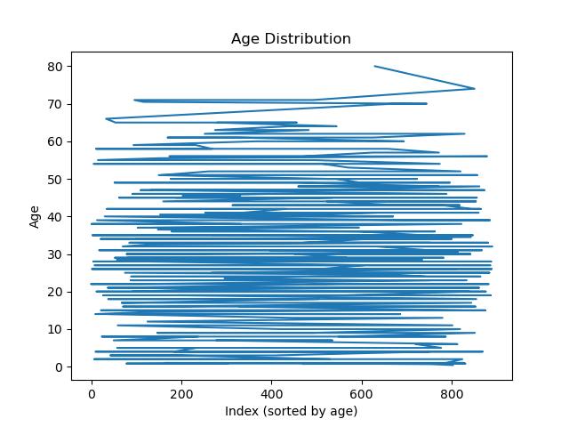
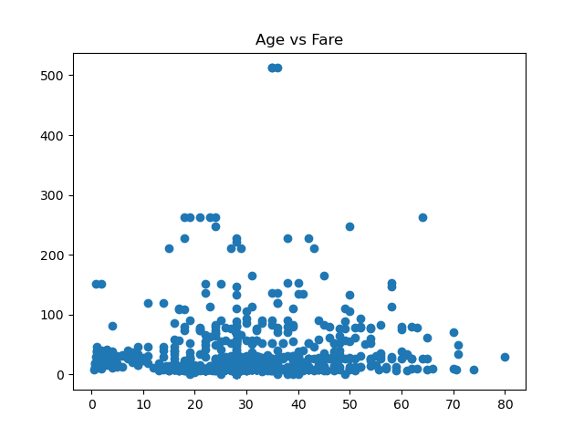
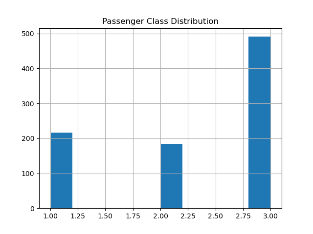
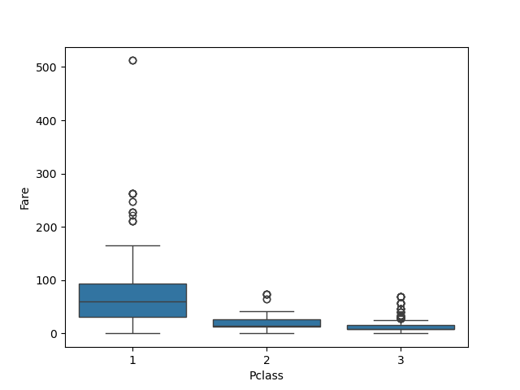
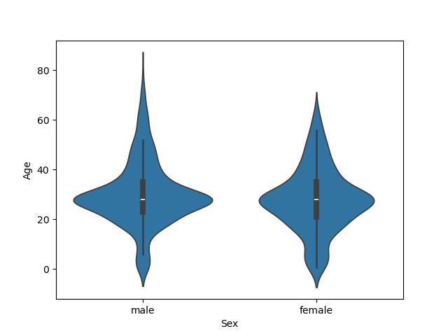
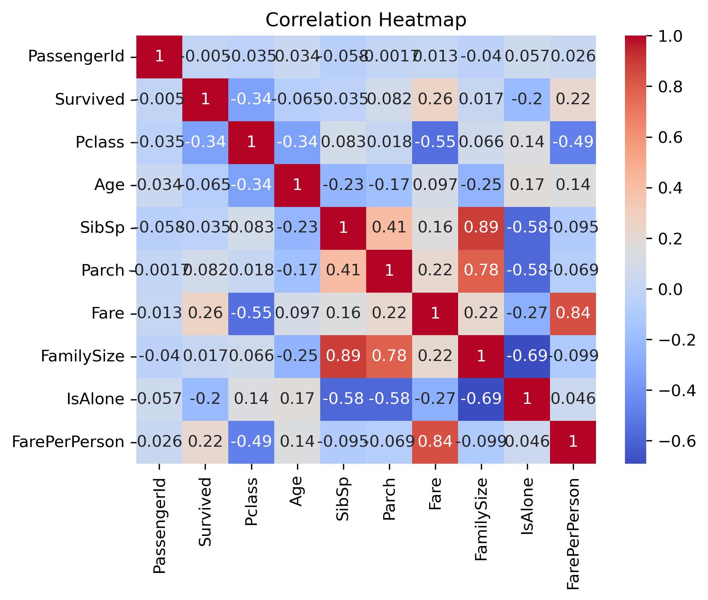

# ML-Internship-B01 🚀

**Name:** Sabeel Ur Rehman  
**Batch:** B01  
**Internship Start Date:** 27-12-2025  

---

## 📌 Description
This repository contains all tasks, assignments, and learning progress completed during the **Machine Learning Internship – Batch B01**.  
The work is organized week-wise and focuses on Python fundamentals, data manipulation, visualization, and machine learning preparation.

---

## 📑 Table of Contents
- Installation
- Usage
- Weekly Progress
- Screenshots
- Technologies
- Resources
- License
- Contact

---

## ⚙️ Installation
Clone the repository:
```bash
git clone https://github.com/sabeelkhattak/ML-Internship-B01.git
```

---

## ▶️ Usage
Navigate to the project directory:
```bash
cd ML-Internship-B01
```

Run Python scripts or open Jupyter notebooks according to the week.

---

## 📅 Weekly Progress

| Week | Topics Covered | Status |
|------|---------------|--------|
| Week 1 | Git & GitHub Basics | ✅ Completed |
| Week 2 | NumPy, Pandas, Data Visualization, OOP | ✅ Completed |

---

## 🖼 Screenshots & Visualizations

### Week 2 – Titanic Dataset Visualizations

**Line Plot – Age Distribution**  


**Scatter Plot – Age vs Fare**  


**Histogram – Passenger Class Distribution**  


**Bar Chart – Survival Rate**  


**Box Plot – Fare by Passenger Class**  


**Violin Plot – Age by Gender**  


**Correlation Heatmap**  


**Pair Plot – Numerical Features**  


---

## 🛠 Technologies Used
- Python
- NumPy
- Pandas
- Matplotlib
- Seaborn
- Scikit-learn
- Git
- GitHub
- Jupyter Notebook

---

## 🔗 Resources
- https://git-scm.com/doc
- https://docs.github.com
- https://numpy.org/doc/
- https://pandas.pydata.org/docs/

---

## 📜 License
This project is licensed under the **MIT License**.

---

## 📧 Contact
**Sabeel Ur Rehman**  
📧 Email: sabeelkhattak556@gmail.com
